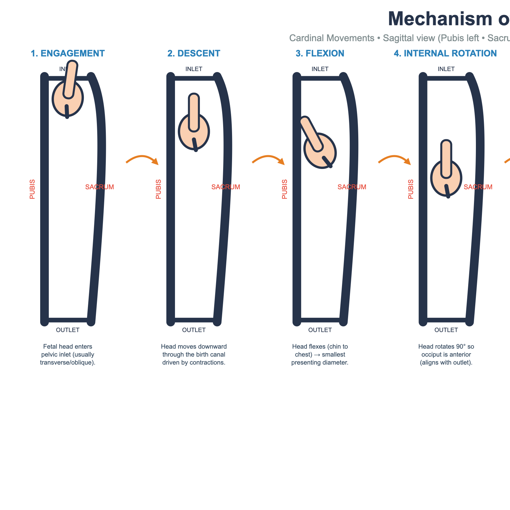
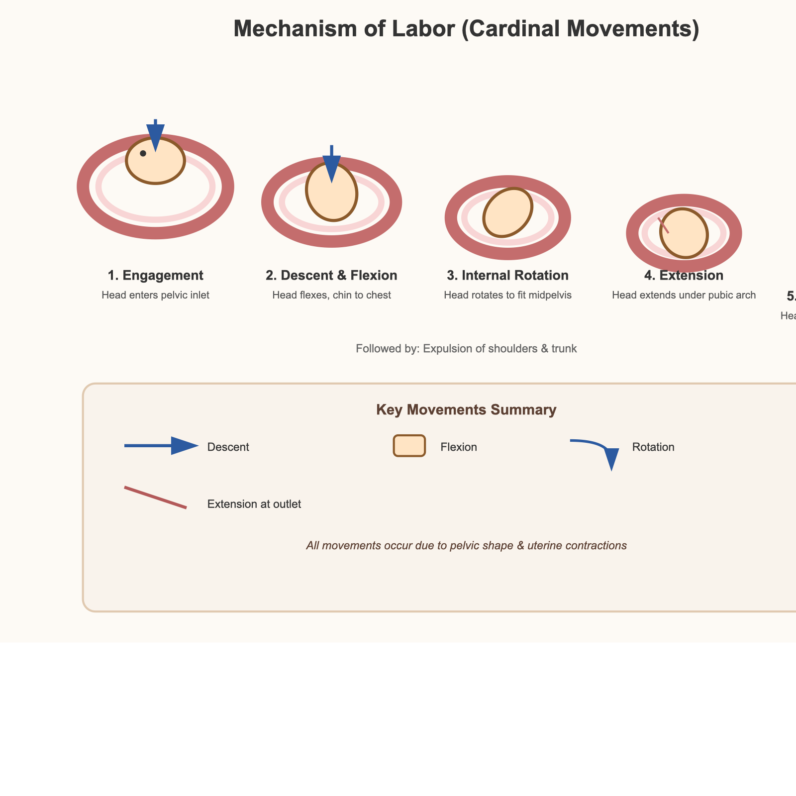
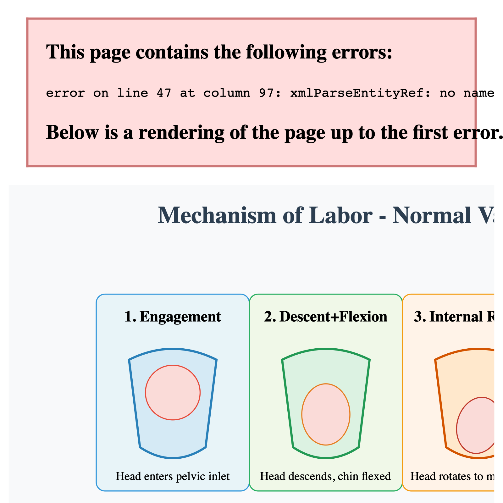
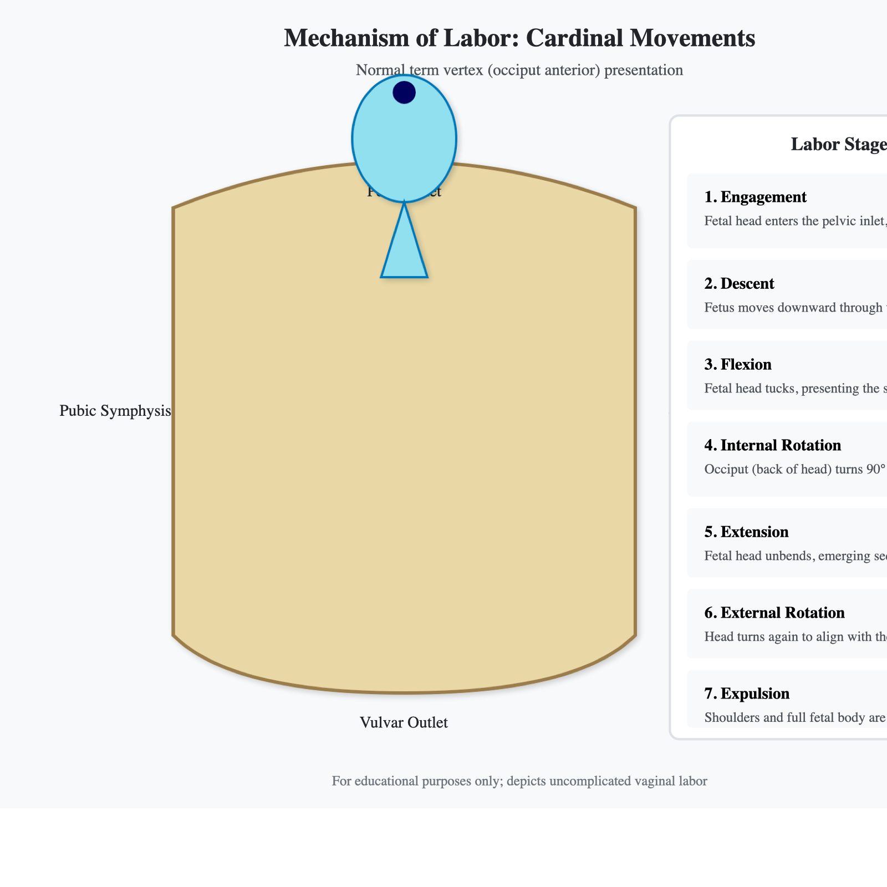

# Mechanism of Labor — SVG Generation Benchmark

LLM benchmark: **Generate SVG description of the process of "mechanism of labor"**

Inspired by [Simon Willison's Pelican on a Bicycle](https://github.com/simonw/pelican-bicycle).  
Full analysis: [`BLOG.md`](BLOG.md) · Visual gallery: [`gallery.html`](gallery.html) · Raw scores: [`BENCHMARK_REPORT.md`](BENCHMARK_REPORT.md)

**Test date:** 2026-05-16 · **Judge:** GPT-5.5 · **Scoring:** 7 criteria × 1–5 pts = 35 max

---

## Prompt

```
Generate SVG description of the process of "mechanism of labor"
```

Each model tested in two modes: **Chat** (web UI screenshot → SVG → PNG) and **API** (OpenRouter direct call, same prompt, rendered with `qlmanage -t -s 1600`).

---

## Scores

| Model | Chat | API | Note |
|-------|------|-----|------|
| **GLM 5.1 Thinking** | **24/30*** | **21/30*** | C7 truncated; only model with FROM ABOVE view |
| Gemini 3 Pro | 15/35 | **23/35** | Chat = text-only infographic; biggest Chat-API gap (8 pts) |
| Claude 4.7 Opus | 18/35 | **22/35** | Chat SVG is 40KB, largest in batch |
| Kimi K2.6 *(fixed)* | 21/30* | 16/35 | Original both failed to render |
| ChatGPT 5.5 Thinking | 11/25* | 21/35 | Best external rotation in API version (C5=4) |
| MiniMax MAX | **21/35** | 16/35 | Chat beats API by 5 pts |
| Grok | 16/35 | 15/35 | Both versions right-side clipped |
| Doubao | 10/35 | 13/35 | Chat XML parse error |
| Kimi K2.6 *(original)* | 7/35 | 7/35 | SVG syntax error; both failed to render |

\* Truncated GPT-5.5 output — score out of available dimensions only

---

## Gallery

### GLM 5.1 Thinking — Chat 24/30\* · API 21/30\*

| Chat | API |
|------|-----|
|  |  |

Only model to include a FROM ABOVE (axial) view for internal rotation. 8-panel Chat version covers all 7 cardinal movements with direction arrows throughout.

---

### Gemini 3 Pro — Chat 15/35 · API 23/35

| Chat | API |
|------|-----|
|  |  |

Chat version: a beautiful product-style text timeline with zero anatomical graphics. API version: fetal heads moving through a pelvis with arrows. 8-point gap, same model.

---

### Claude 4.7 Opus — Chat 18/35 · API 22/35

| Chat | API |
|------|-----|
|  |  |

Chat SVG is 40,993 bytes — largest in the batch — but motion arrows scored C6=1 (lowest). API version at 6,559 bytes scored C6=3. More code ≠ better diagram.

---

### Kimi K2.6 Thinking — original 7/35 → fixed Chat 21/30\*

| Chat (fixed) | Chat (original error) |
|---|---|
|  |  |

One character (`<<svg` double angle bracket) caused total render failure. Fix: remove the extra `<`. Fixed version scored 21/30*, matching GLM 5.1 API.

---

### ChatGPT 5.5 Thinking — Chat 11/25\* · API 21/35

| Chat | API |
|------|-----|
|  |  |

API version has the best external rotation depiction in the batch (C5=4). Chat version skips step numbering from 3 to 5.

---

### MiniMax MAX — Chat 21/35 · API 16/35

| Chat | API |
|------|-----|
|  |  |

Chat version includes a "Labor Progress" progress bar and rotation arrows. API version uses a vertical stack of circles to represent descent — an abstract choice that loses rotation mechanics entirely.

---

### Grok — Chat 16/35 · API 15/35

| Chat | API |
|------|-----|
|  |  |

Both versions generate SVG wider than their viewBox. Right-side steps (external rotation, expulsion) are clipped in both versions.

---

### Doubao — Chat 10/35 · API 13/35

| Chat | API |
|------|-----|
|  |  |

Chat version has an XML parse error; renders only the first three steps. API version labels anatomy correctly in text but represents the fetus as a blue triangle with inconsistent orientation.

---

### Manus 1.6 MAX — not scored

Manus is an AI Agent, not a pure LLM. It output the SVG source code as text rather than a rendered diagram. A dedicated agent-oriented test would be needed for a fair comparison.

---

## Key Findings

1. **Anatomical accuracy (C2) is the weakest dimension across all models** — mean ~1.9/5. Models can name the structures; they cannot draw them.

2. **Internal rotation requires an axial (top-down) view** — only GLM 5.1 provided one. All other models attempted to depict rotation in a sagittal side view, which cannot show it properly.

3. **Chat vs API gap is large and inconsistent** — Gemini diverges by 8 points. MiniMax Chat beats API by 5 points. Claude API beats Chat by 4 points. You cannot infer API capability from Chat UI behavior.

4. **Code size and diagram quality have no meaningful correlation** — Claude's 40KB Chat SVG scored worse on motion arrows than its 6KB API output.

5. **Technical failures (SVG syntax, layout overflow, XML errors) outnumbered pure capability failures** — Kimi, Grok, and Doubao all had rendering issues unrelated to their medical knowledge.

---

## Files

```
[BENCHMARK] Mechanism of labor/
├── README.md              ← this file
├── BLOG.md                ← full narrative analysis
├── gallery.html           ← visual gallery (open in browser)
├── BENCHMARK_REPORT.md    ← raw scoring data
├── Claude 4.7 Opus/       chat.png  api.png  chat.svg  api.svg  *_gpt55.txt
├── Chatgpt 5.5 thinking/  ...
├── Doubao/                ...
├── GLM 5.1 Thining/       ...
├── Gemini 3 Pro/          ...
├── Grok/                  ...
├── Kimi K2.6 Thinking/    ... (includes chat_fixed.png, api_fixed.png)
├── Manus 1.6 MAX/         content.svg  input.png  output.png
└── MiniMax MAX/           ...
```
